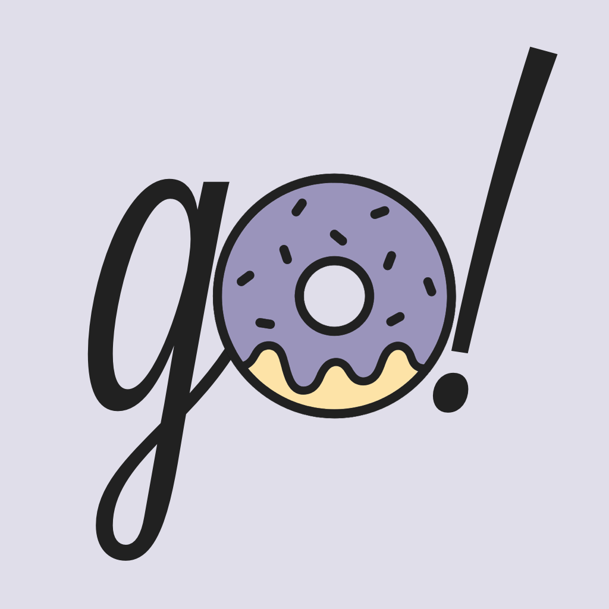
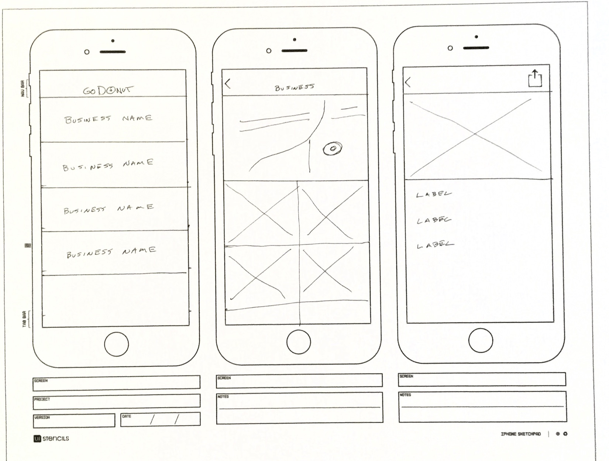
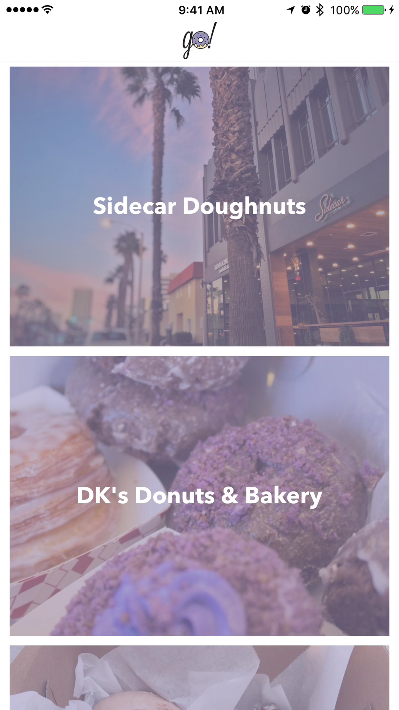
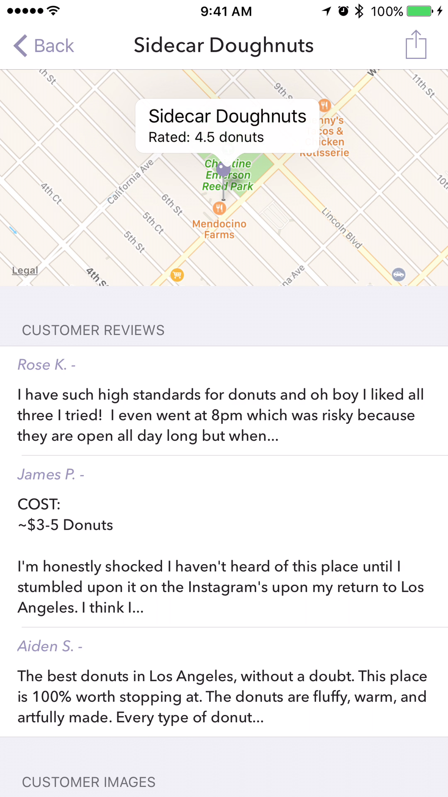
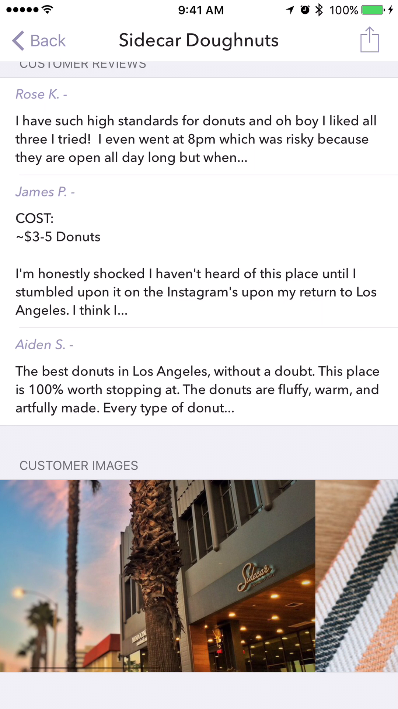
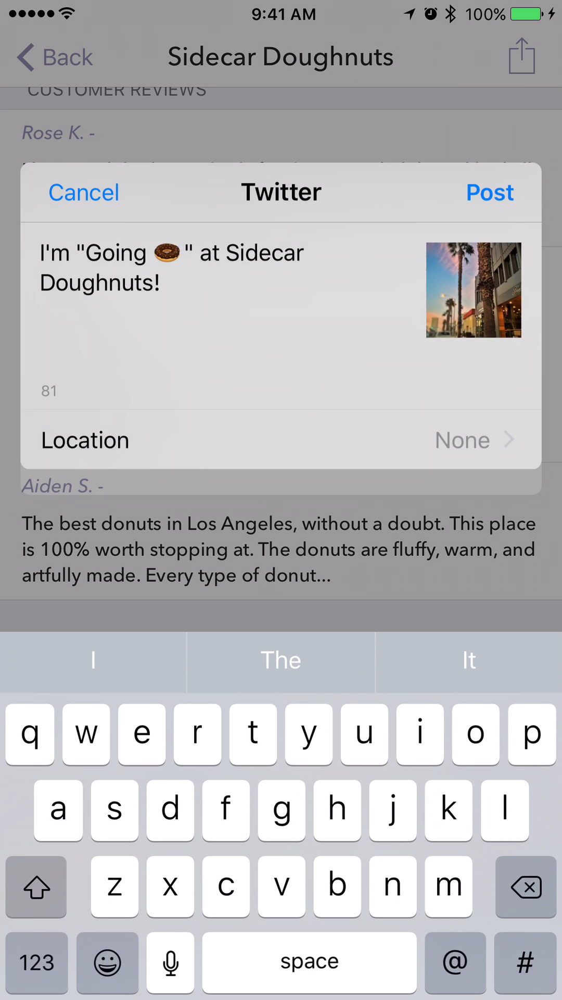

# Go-Donut

---

# Prototype

---

# All Locations

* Searches for donuts near current location.
* `UITableView` updates automatically when user moves more than 200 meters.

---

# Custom Refresh Animation

---

# Detail View

* Shows business on map with custom pin
* Customer reviews displayed in `UITableView`

---

# Customer Images

Shown in `UIScrollView` embedded in `UITableViewCell`.

---

# Sharing

Users can share info about the current business using the action button at the top of the screen.

---

# Questions?

---

# UI Demo

