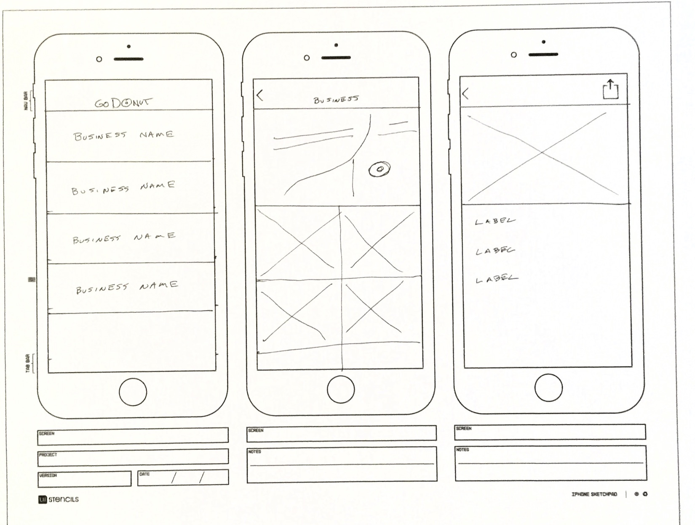
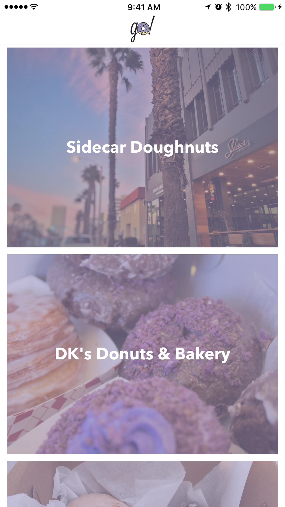
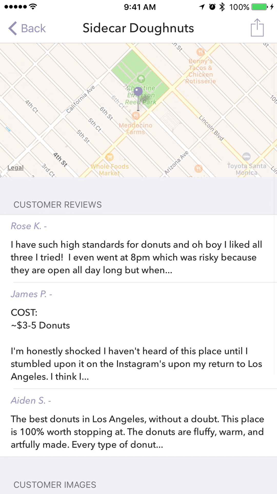
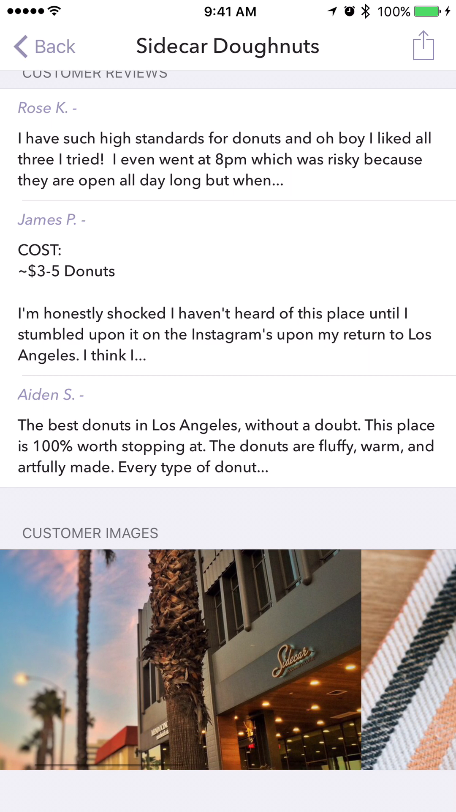
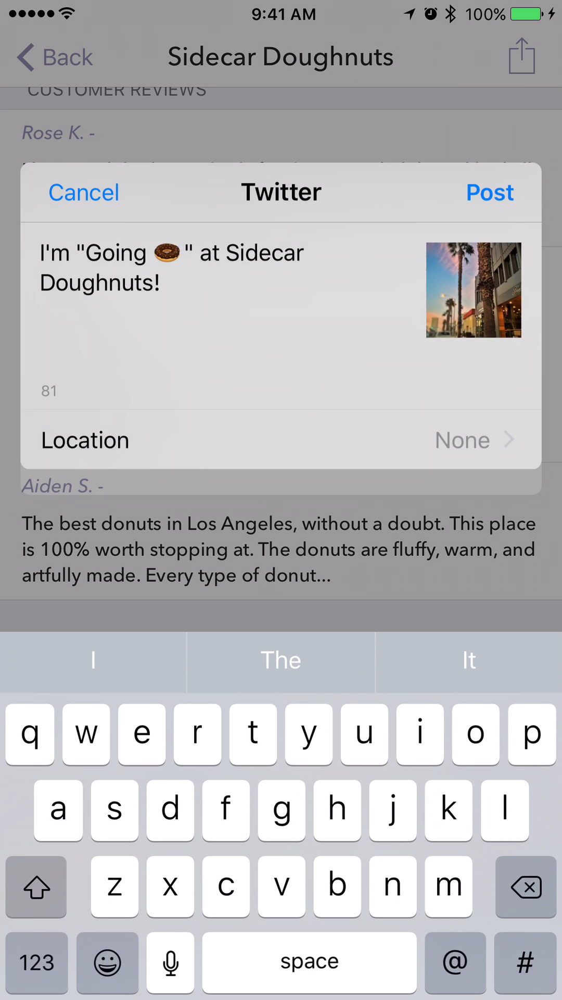

# GoDonut

GoDonut is iOS app that allows users to satisfy their donut craving. It uses **CoreLocation** and the **Yelp API** to locate businesses near the user's current location.

*Project 2 - iOS Immersive class at General Assembly*

## Initial Prototype

## All Locations Screen

This screen access the user's location to find businesses selling donuts. The name and image of each business is displayed in a `UITableView`. The list is automatically refreshed if the user moves more than 200 meters while the app is open.

### Custom Pull-to-Refresh

Users can trigger a search using pull-to-refresh at any time. I replaced the standard spinner in the refresh control with a rotating donut. 

## Location Details Screen

After selecting a location, users are taken to a detail view, where they can view the business location on a map, read customer reviews, and view customer images.

### Images ScrollView

Customer images are displayed in a `UIScrollView`, which is embedded unto a `UITableViewCell`. 

### Social Sharing

Users can share the location they are viewing by tapping the action at the top of the screen. 

